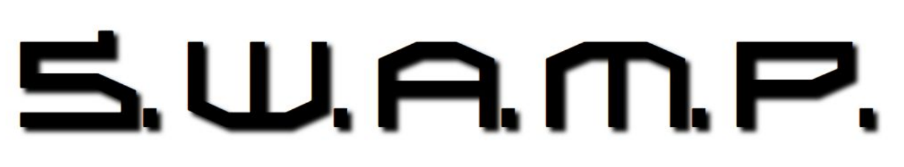
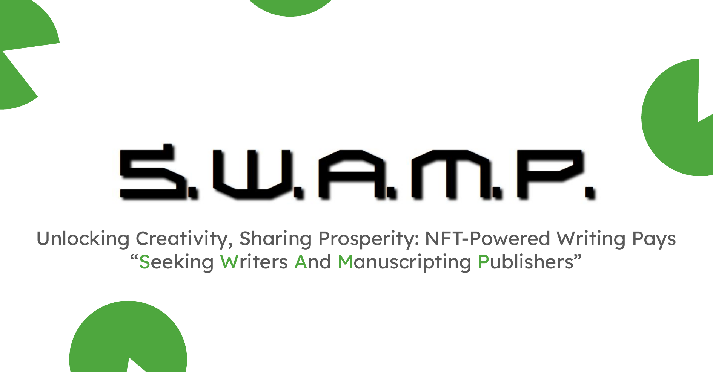

# SWAMP Platform

> Seeking Writers And Manuscripting Publishers

## Introduction
Welcome to SWAMP, a revolutionary platform that leverages blockchain technology to empower writers and enrich readers' experiences. Our goal is to address the challenges faced by authors in traditional publishing models and provide a fair, transparent, and efficient system for content creation and consumption.

## Problem Statement
- Long payout durations for authors.
- Unfair income distribution leading to a decline in writing quality.
- Limited access to unique and captivating content for readers.

## Our Hypothesis
Creating a platform where readers pay for each post using blockchain tokens ensures permanent and direct payment to authors, fostering a more equitable ecosystem.

## Solution: The SWAMP Ecosystem
- **SWAMP Aggregator**: A unique environment where authors and readers can interact, write, and read posts.
- **Smart Contracts**: Serve as a fair intermediary for payments and publishing.
- **Leaves Token (LVS)**: The primary currency within SWAMP, facilitating transactions.

### Key Features
1. **Author Uploads**: Authors upload their content ('cuts') to the platform.
2. **Mintor System**: A system that creates daily 'papers' for readers from the authors' cuts.
3. **PaperNFT**: Each paper is associated with a PaperNFT, representing the content's value.
4. **Reader Engagement**: Readers can check available PaperNFTs and pay for specific "paper levels" depending on the content quality and category.

### SWAMP Structure
- **Seeking Writers and Manuscripting Publishers**: Focused on attracting quality content creators and publishers.
- **Subscriptions and Payments**: Flexible subscription models and easy payment options.
- **Upload Cuts on Author Page**: A simple and intuitive interface for content submission.

## Future Developments
- Integration of AI Algorithms for content curation.
- Exploration of CutNFT and BookNFT concepts.
- Development of a mobile application for wider access.

## Deployment
- The platform will be accessible at [swamp.press](http://swamp.press).

## Presentation

For more detailed insights into our project, view our presentation:

[View the full PDF presentation here](content/SWAMP.pdf)

## Contact and Support
For more information or to address any queries, feel free to reach out to us.

